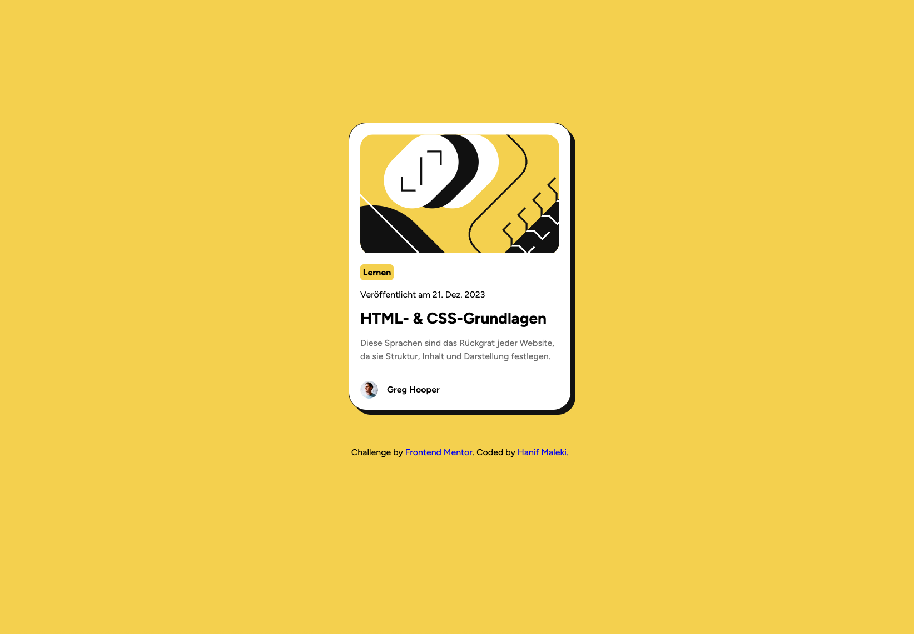

# Frontend Mentor - Blog preview card solution

This is a solution to the [Blog preview card challenge on Frontend Mentor](https://www.frontendmentor.io/challenges/blog-preview-card-ckPaj01IcS). Frontend Mentor challenges help you improve your coding skills by building realistic projects. 

## Table of contents

- [Overview](#overview)
  - [The challenge](#the-challenge)
  - [Screenshot](#screenshot)
  - [Links](#links)
- [My process](#my-process)
  - [Built with](#built-with)
  - [What I learned](#what-i-learned)
  - [Continued development](#continued-development)
  - [Useful resources](#useful-resources)
- [Author](#author)

## Overview

### The challenge

Users should be able to:

- See hover and focus states for all interactive elements on the page

### Screenshot



### Links

- Solution URL: [Solution](https://github.com/hanifmaleki/Blog-Preview-Card)
- Live Site URL: [Live site](https://hanifmaleki.github.io/Blog-Preview-Card)

## My process

### Built with

- Semantic **HTML5** markup  
- **CSS custom properties**  
- **Flexbox**  
- **CSS Grid**  
- **Mobile-first workflow**  
- **Pug** template language  
- **SCSS** (with variables and mixins)  
- **GitHub Actions** (for CI/CD pipeline)  
- **GitHub Pages** (for deployment)  
- **Neovim** (as main editor)  
- **i18 translations**
- **npm scripts** (`copy-js`)  
- [chokidar-cli](https://github.com/open-cli-tools/chokidar-cli)


### What I learned
In this project I experimented with client-side translations using a simple function that replaces placeholders with dynamic parameters:

```js
window.onload = () => {
    render()
}

function trans(key, parameters) {
    const lang = document.documentElement.lang || 'en'
    let text = window.translations[lang][key] || key 
    for (const [p, v] of Object.entries(parameters)) {
        text = text.replace(`{${p}}`, v)
    }
    return text
}

function render() {
    document.querySelectorAll('[data-i18n]').forEach(el => {
        const key = el.dataset.i18n 
        const params = {}
        for (const [name, value] of Object.entries(el.dataset)) {
            if (name.startsWith('i18nParam')) {
                const paramName = name.replace('i18nParam', '').toLowerCase()
                params[paramName] = value 
            }
        }
        el.textContent = trans(el.dataset.i18n, params)
    })
}

```

This allowed me to keep my Pug templates clean and only declare the translation keys:
```pug
.card-container 
    .card-image-container
        img.card-image(src='assets/images/illustration-article.svg', alt='Blog Image')
    .card-category(data-i18n='category')
    .card-date(data-i18n='card_date')
    .card-title(data-i18n='card_title')
    .card-description(data-i18n='card_description')
    .card-author-container 
        img.card-author-image(src='assets/images/image-avatar.webp', alt='Author Avatar')
        .card-author-name Greg Hooper 
```

Another improvement was replacing the default watch command with chokidar, which finally fixed the persistent SCSS watch issue I had in previous projects.

### Continued development
In future projects, I plan to:
- Refine my translation system (supporting external JSON files and runtime language switching).
- Improve the package.json structure by externalizing chokidar configurations for cleaner watch commands.

## Author

- Frontend Mentor - [@hanifmaleki](https://www.frontendmentor.io/profile/hanifmaleki)
